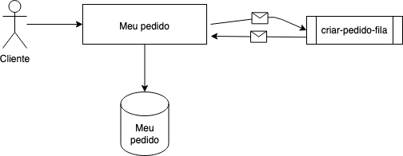

# Meu Pedido


[![LinkedIn][linkedin-shield]][linkedin-url]

<!-- PROJECT LOGO -->
<br />
<p align="center">
  <a href="https://github.com/othneildrew/Best-README-Template">
 </a>

<h3 align="center">Meu Pedido</h3>


<!-- TABLE OF CONTENTS -->
<details open="open">
  <summary>Table of Contents</summary>
  <ol>
    <li>
      <a href="#about-the-project">Sobre o Projeto</a>
      <ul>
        <li><a href="#built-with">Built With</a></li>
      </ul>
    </li>
    <li>
      <a href="#getting-started">Começando</a>
      <ul>
        <li><a href="#prerequisites">Pré-Requisito</a></li>
        <li><a href="#installation">Instalação</a></li>
      </ul>
    </li>
    <li><a href="#usage">Como usar</a></li>
    <li><a href="#contact">Contato</a></li>
  </ol>
</details>


<!-- ABOUT THE PROJECT -->
## Sobre o Projeto
API Rest com a função principal de Cadastrar um Pedido e Gerar Relatórios.

Os principais recursos desta API são:

<ol>
<li><a href="#1">Enviar Pedido Para Fila RabbitMQ</a></li>
<li><a href="#2">Pedidos Realizados Por Cliente e Quantidade Total</a></li>
<li><a href="#3">Valor total do pedido</a></li>

</ol>

### Decisões Técnicas

* Arquitetura:
    * A Arquitetura do projeto foram dividida em três camadas:
        * Business: A camada de business representa toda regra de negócio do desafio, onde ficará os casos de uso (services),
          e utils na qual será utilizado para apoiar a regra de negócio.
        * Data: A camada de data, representa os dados transacionais que serão armazenados e manipulado em tempo de execução.
        * Web: A camada web representa o entrypoint do projeto, onde chegará as requisições e também as comunicações externas da API.
      
  * Motivo:
    * Seguindo este padrão de arquitetura, há uma facilidade de identificar os contextos e responsabilidade de cada camada na aplicação.
            Facilitando assim sua manutibilidade e entendimento.
    * Versionamento da API: A estrategia de versionamento utilizada é de aplicar a versao na URI da API e no projeto separar as controllers com as respectivas versões por pacotes. E além disto, deixar a Collection na raiz do projeto e no repositório, para que a documentação da API seja também versionada.

  * Diagrama Arquiteturial:
    
  
  * Modelagem da Base de Dados:
    

### Built With

As tecnologias usadas neste projeto são:
* [SpringBoot](https://spring.io/projects/spring-boot)
* [RabbitMQ](https://www.rabbitmq.com/)
* [Postgres](https://www.postgresql.org/)
* [Java 17](https://www.oracle.com/java/technologies/javase/jdk17-archive-downloads.html)
* [Lombock](https://projectlombok.org/)
* [Docker](https://www.docker.com/)


<!-- GETTING STARTED -->
## Começando

### Pré-Requisitos

* Verifique seu Maven (a versão do maven construída é 3.8.6)

  ```sh
  mvn -version
  ```

* Verifique a versão do Java (As versões utilizadas são: ````openjdk version "18.0.2.1" 2022-08-18
  OpenJDK Runtime Environment (build 18.0.2.1+1-1)
  OpenJDK 64-Bit Server VM (build 18.0.2.1+1-1, mixed mode, sharing)````

    ```sh
    java -version
    ```

### Installation

1. Clone o repositorio
   ```sh
   git clone https://github.com/DanFonseca/meuPedido.git
   ```
2. Up Docker Daemon e insira o comando abaixo no projeto raiz
   ```sh
   docker-compose up -d
   ```
   
3. Você pode importar as collections do PostMan na raiz desta  projeto 
(meu-pedido.postman_collection.json)
4. Importe o projeto em sua IDE favorita e pronto =)

<!-- USAGE EXAMPLES -->
## Usage

* ### 1 Enviar Pedido Para Fila RabbitMQ

```sh
curl --location 'localhost:8080/v1/pedido' \
--header 'Content-Type: application/json' \
--data '{
    "codigoPedido": 1001,
    "codigoCliente": 1,
    "itens": [
        {
            "produto": "lápis",
            "quantidade": 100,
            "preco": 1.10
        },
        {
            "produto": "caderno",
            "quantidade": 10,
            "preco": 1.00
        }
    ]
}'
   ```

* ### 2 Pedidos Realizados Por Cliente e Quantidade Total
```sh
curl --location 'localhost:8080/v1/report/pedido/quantidade?codigoCliente=1'
   ```

* #### Resposta

```json
{
  "quantidade_total_de_pedidos": 1,
  "pedidos": [
    {
      "id": 52,
      "codigo_pedido": 1001,
      "cliente": {
        "id": 1,
        "codigo_cliente": 1
      },
      "itens": [
        {
          "id": 52,
          "quantidade": 100,
          "preco": 1.1,
          "produto": "lápis"
        },
        {
          "id": 53,
          "quantidade": 10,
          "preco": 1.0,
          "produto": "caderno"
        }
      ]
    }
  ]
}
   ```
 

* ### 3 Valor total do pedido
```sh
curl --location 'localhost:8080/v1/report/pedido?codigoPedido=1001'
   ```
* #### Resposta

```json
{
  "valor_total_do_pedido": 2.1,
  "codigo_cliente": 1
}
   ```

<!-- LICENSE -->
## License

Distributed under the MIT License. See `LICENSE` for more information.


<!-- CONTACT -->
## Contato

Daniel Fonseca  - daniel.freitas.ms1@gmail.com


<!-- MARKDOWN LINKS & IMAGES -->
<!-- https://www.markdownguide.org/basic-syntax/#reference-style-links -->
[stars-shield]: https://img.shields.io/github/stars/othneildrew/Best-README-Template.svg?style=for-the-badge
[stars-url]: https://github.com/othneildrew/Best-README-Template/stargazers
[linkedin-shield]: https://img.shields.io/badge/-LinkedIn-black.svg?style=for-the-badge&logo=linkedin&colorB=555
[linkedin-url]:https://www.linkedin.com/in/%F0%9F%91%A8%F0%9F%8F%BD%E2%80%8D%F0%9F%92%BB-daniel-freitas-28666a134/
